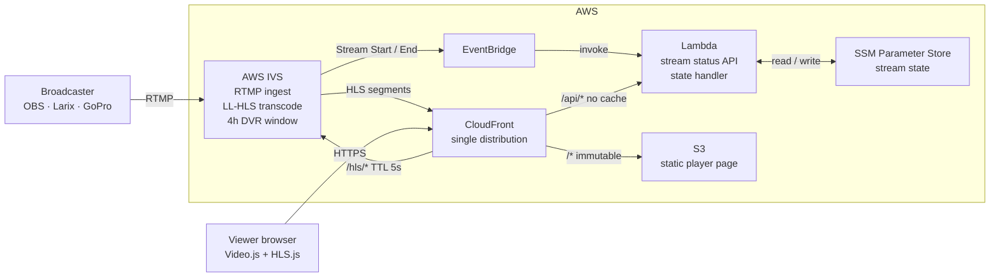
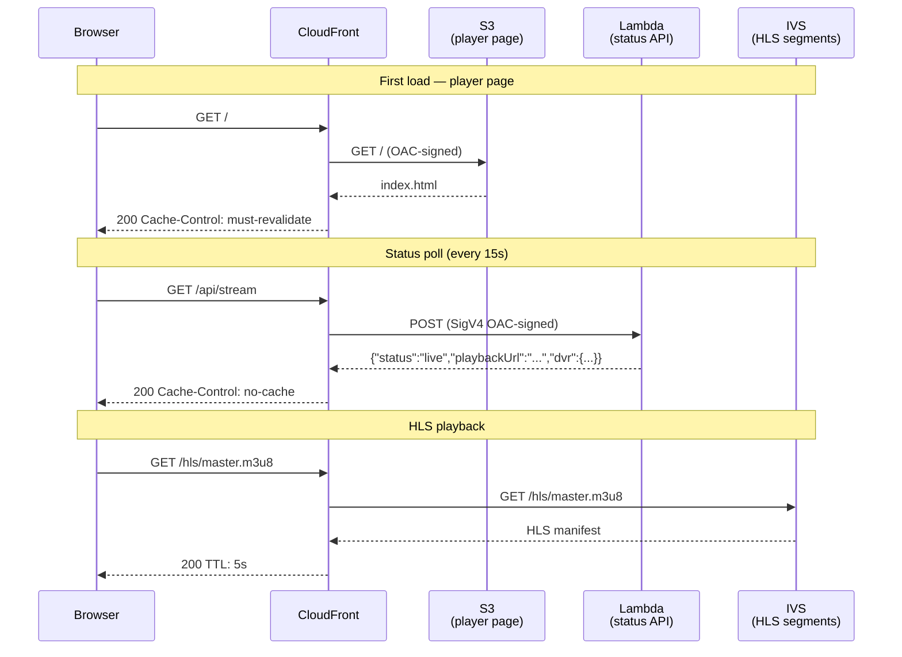
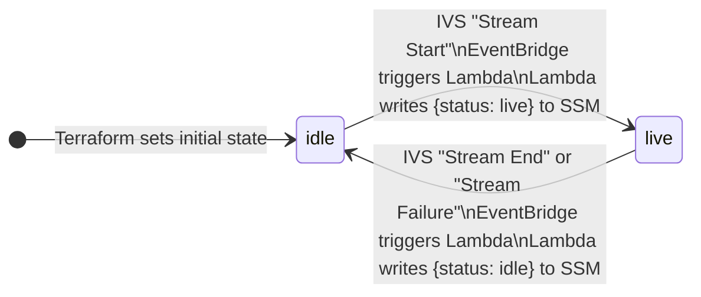

AWS IVS gives you managed RTMP ingest, LL-HLS transcode, and a built-in 4-hour DVR window. CloudFront gives you a global CDN. Lambda gives you a cold-start-under-200ms API. Put them together with a bit of Terraform and you get a live streaming platform that costs nothing at rest, scales automatically, and lets viewers rewind up to four hours — no S3 recording bucket, no media server, no operational overhead.

This post walks through the architecture of [Streamline](https://github.com/mguarinos/streamline), the design decisions behind it, and why certain pieces are wired together the way they are.

---

## Architecture

The whole system fits in one diagram. A broadcaster pushes RTMP to IVS. Viewers hit a single CloudFront distribution that fans out to three origins depending on the URL path. A side channel — EventBridge → Lambda → SSM — keeps stream state without any polling.



There is no media server. There is no recording bucket. IVS handles ingest and transcode entirely on its own infrastructure. CloudFront is the only public surface — the S3 bucket and Lambda function URL both reject requests that don't come through CloudFront.

---

## The DVR window

IVS STANDARD channels maintain a rolling 4-hour DVR window internally. There is no `recording_configuration_arn`, no S3 bucket, no retention policy. The HLS manifest IVS generates contains the full seekable range. Video.js reads it automatically when you set `liveui: true` — no special URL parameters or player configuration required beyond that flag.

While a stream is live, a viewer can drag the progress bar all the way back to hour zero. Clicking the **LIVE** button snaps back to the live edge instantly. When the stream ends, the DVR segments are discarded — no storage cost, no retention policy to manage, no GDPR surface area for recorded content.

---

## How request routing works

A single CloudFront distribution handles three completely different types of traffic. The path prefix determines which origin receives the request:



Each origin has its own cache policy:
- **S3** (`/*`): `index.html` gets `must-revalidate` (always fresh); other assets get `immutable` (hash in filename, 1-year TTL)
- **Lambda** (`/api/*`): `no-cache` — the Lambda itself has a 10-second in-memory cache, so CloudFront doesn't need to
- **IVS** (`/hls/*`): 5-second TTL — long enough to reduce origin hits, short enough that the live edge stays fresh

---

## Stream state: EventBridge + SSM instead of polling

The player needs to know whether a stream is live before it tries to load an HLS manifest. The naive approach — calling IVS `GetStream` on every API request — adds unnecessary latency and cost at scale. The approach here is event-driven:



When a broadcaster goes live, IVS fires a `Stream Start` event to EventBridge. EventBridge invokes Lambda, which writes `{"status":"live","updatedAt":"..."}` to an SSM Parameter. When the stream ends or fails, the same path runs in reverse.

The `/api/stream` handler reads this SSM parameter (with a 10-second module-level cache) and returns the current state to the player. The Lambda function never polls IVS directly during normal operation — IVS pushes state changes to it. If the SSM parameter doesn't exist yet (stream has never been live), `ParameterNotFound` is caught and mapped to `idle`.

---

## Security: why the Lambda rejects direct requests

The Lambda function URL is configured with `authorization_type = "AWS_IAM"`. Access is granted exclusively to `cloudfront.amazonaws.com` with a condition scoped to this specific distribution's ARN. CloudFront uses an Origin Access Control (OAC) to sign every request to the Lambda origin with SigV4 before forwarding it.

The practical result: requests arriving at the function URL from any other source — curl, another Lambda, another CloudFront distribution — are rejected by IAM before they reach the function code. The same OAC pattern applies to S3, where the bucket policy blocks all public access and only allows requests signed by this distribution's OAC.

---

## Infrastructure as code

Five focused Terraform modules:

| Module | Responsibility |
|---|---|
| `ivs` | IVS channel, stream key, Secrets Manager secret |
| `s3` | Frontend bucket, CloudFront OAC |
| `lambda` | IAM role, SSM parameter, function, alias, function URL, EventBridge rule |
| `cloudfront` | Distribution, three origins, cache behaviours, optional custom domain wiring |
| `dns` | ACM certificate (us-east-1), Route 53 validation records and alias |
| `monitoring` | CloudWatch alarms for Lambda errors/throttles and CloudFront 5xx; SNS topic |

The S3 bucket policy and the Lambda permission for CloudFront live in the root module. This is intentional: both need values from two different modules (`s3`/`cloudfront` and `lambda`/`cloudfront` respectively), and putting them in either child module would create a circular dependency. Wiring them at the root lets Terraform resolve the dependency order in a single apply.

State locking uses Terraform 1.10's native S3 locking (`use_lockfile = true`). No DynamoDB table required.

---

## Deployment pipeline

Every production deploy is triggered by a semver tag:

```bash
git tag v1.0.0 && git push origin v1.0.0
```

The workflow runs three jobs. `prepare` extracts the version and detects which paths changed. `deploy-frontend` and `deploy-lambda` run in parallel and only execute if their respective paths changed since the previous tag.

`deploy-lambda` builds the TypeScript source, prunes devDependencies, zips `dist/` and `node_modules/`, uploads the zip to Lambda, waits for propagation, publishes an immutable version snapshot, and points the `live` alias at it. Every Lambda version is immutable — rolling back is a single AWS CLI call:

```bash
aws lambda update-alias \
  --function-name streamline-prod \
  --name live \
  --function-version PREVIOUS_VERSION_NUMBER
```

GitHub Actions authenticates to AWS via OIDC. There are no long-lived AWS credentials stored as secrets.

---

## Getting started

```bash
git clone https://github.com/mguarinos/streamline.git
cd streamline
./scripts/bootstrap.sh          # creates state bucket, OIDC provider, deploy role
cd terraform
terraform init -backend-config=backend.hcl
terraform apply
terraform output                # note the ingest endpoint and stream key command
```

Full setup instructions are in the [README](https://github.com/mguarinos/streamline).
